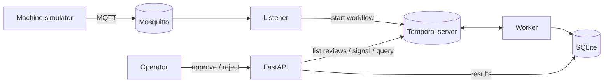

# Telemetry Orchestrator

An event-driven pipeline that validates and processes industrial machine telemetry using
[Temporal](https://temporal.io) workflows, with automatic retries, a human-in-the-loop review
step for anomalies, and full execution traceability.

Simulated machines publish readings to an MQTT broker using a Sparkplug-style topic namespace.
A listener batches the readings per machine and starts one durable workflow per batch.



### Workflow: `TelemetryBatchWorkflow`

1. **Validate**: reject missing, non-numeric, out-of-range, or future-dated readings.
2. **Process**: per-metric summary statistics; flag readings above alarm thresholds.
3. **Review** (only if anomalies): mark itself `ReviewStatus = pending` and wait durably for an
   operator's approve/reject signal. Other batches keep flowing meanwhile; nothing blocks on the
   review. The batch is auto-rejected (`ReviewStatus = timed_out`) if no decision arrives in time.
4. **Store**: persist the outcome idempotently.

Every step has a timeout and a retry policy with exponential back-off. The current step can be
read at any time through a workflow query, and the full event history is visible in the Temporal Web UI.

**The review queue lives in Temporal, not in a separate table.** Workflows tag themselves with
search attributes (`ReviewStatus`, `MachineId`, `AnomalyCount`), and `GET /reviews` queries Temporal
for running workflows marked `pending`. The queue therefore can never list a batch that no longer
exists, and you can filter it in the Web UI too, for example: `ReviewStatus = "pending"`.

## Tech stack

Python 3.12 · Temporal (Python SDK) · MQTT (Mosquitto, paho-mqtt) · FastAPI · SQLite · Docker · pytest

## Running locally

Requirements: Docker Desktop and Python 3.11+.

```powershell
# 1. Set the broker passwords (first time only), then edit .env with your own values
Copy-Item .env.example .env

# 2. Start Temporal + Mosquitto
docker compose up -d

# 3. Create the environment (first time only)
py -3.12 -m venv .venv
.venv\Scripts\python -m pip install -r requirements.txt -e .
```

Then run each of these in its own terminal (activate first with `.venv\Scripts\activate`,
or replace `python` with `.venv\Scripts\python`):

```powershell
python -m telemetry.worker                      # executes workflows and activities
python -m telemetry.listener                    # MQTT -> workflows
python -m uvicorn telemetry.api:app --port 8000 # operator API
python -m telemetry.simulator --machines 3      # publishes telemetry
```

| What | Where |
|---|---|
| Temporal Web UI (workflow history, retries, pending signals) | http://localhost:8233 |
| API docs (try the endpoints interactively) | http://localhost:8000/docs |

### API

| Method | Path | Purpose |
|---|---|---|
| GET | `/reviews` | Batches waiting for an operator decision (queried from Temporal) |
| POST | `/reviews/{workflow_id}` | Approve or reject: `{"approved": true, "reviewer": "name", "note": "..."}`. Returns 409 if the batch is not awaiting review. |
| GET | `/workflows/{workflow_id}/status` | Current step of a running workflow |
| GET | `/results` | Recently completed batches |

### Demonstrating fault tolerance

```powershell
# Make 30% of database writes fail; watch Temporal retry them with back-off
$env:STORE_FAILURE_RATE = "0.3"; python -m telemetry.worker
```

- **Worker crash:** stop the worker while batches are awaiting review, start it again, then approve
  one. The workflow resumes exactly where it left off.
- **Bad data:** the simulator sends missing and out-of-range values; see them rejected in validation.
- **Review timeout:** start the worker with `$env:REVIEW_TIMEOUT_MINUTES = "1"`, leave a flagged
  batch alone, and watch it auto-reject after a minute.

## Security

The MQTT broker rejects anonymous connections. Each component logs in with its own account,
and topic permissions (`infra/mosquitto.acl`) follow least privilege:

| Account | Can publish telemetry | Can read telemetry |
|---|---|---|
| `simulator` | Yes | No |
| `listener` | No | Yes |

Passwords live only in `.env` (git-ignored). The broker's password file is generated from them,
hashed, each time the container starts. If a login is refused, the simulator and listener stop
with a clear error instead of retrying silently.

Traffic is not yet encrypted, so passwords cross the network in plain text. That is acceptable
on `localhost`, but TLS is required before running across a real network (see Roadmap).

### Tests

```powershell
python -m pytest
```

## Configuration

Environment variables, set in `.env` or the shell (see `src/telemetry/config.py`):
`TEMPORAL_ADDRESS`, `TASK_QUEUE`, `MQTT_HOST`, `MQTT_PORT`, `MQTT_TOPIC`,
`SIMULATOR_MQTT_PASSWORD`, `LISTENER_MQTT_PASSWORD`, `BATCH_SIZE`, `DB_PATH`,
`STORE_FAILURE_RATE`, `REVIEW_TIMEOUT_MINUTES`.

## Roadmap

- [x] MQTT authentication with per-component accounts and topic ACLs
- [x] Review queue served from Temporal search attributes (no separate table to drift out of sync)
- [ ] TLS encryption for MQTT traffic
- [ ] Workflow tests with Temporal's time-skipping test environment (review timeout path)
- [ ] Metrics endpoint (batches processed, rejection rate, review latency)
- [ ] Robot cell task workflow: pick → inspect → place with saga-style compensation on failure
- [ ] Simple web page for the review queue
